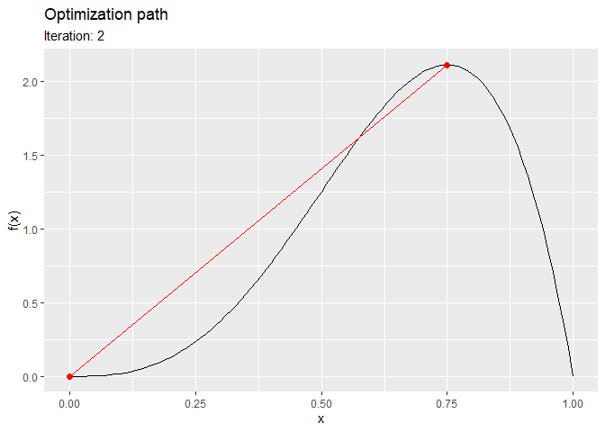

<!-- README.md is generated from README.Rmd. Please edit that file -->

# Track numerical optimization <a href="https://loelschlaeger.de/trackopt/"></a>

<!-- badges: start -->

[](https://CRAN.R-project.org/package=trackopt)
[](https://CRAN.R-project.org/package=trackopt)
[](https://github.com/loelschlaeger/trackopt/actions)
[](https://app.codecov.io/gh/loelschlaeger/trackopt?branch=main)
<!-- badges: end -->

The `{trackopt}` package tracks parameter value, gradient, and Hessian
at each iteration of numerical optimizers in `R`. This can be useful for
analyzing optimization progress, diagnosing issues, and studying
convergence behavior.

## Installation

You can install the released package version from
[CRAN](https://CRAN.R-project.org) with:

``` r
install.packages("trackopt")
```

## Example

The following is the `nlm` minimization track of the [Himmelblau’s
function](https://en.wikipedia.org/wiki/Himmelblau%27s_function):

``` r
library("trackopt")
himmelblau <- function(x) (x[1]^2 + x[2] - 11)^2 + (x[1] + x[2]^2 - 7)^2
track <- nlm_track(f = himmelblau, p = c(0, 0))
print(track)
#> # A tibble: 17 × 7
#>    iteration         value     step parameter gradient  hessian        seconds
#>  *     <dbl>         <dbl>    <dbl> <list>    <list>    <list>           <dbl>
#>  1         0 170            0       <dbl [2]> <dbl [1]> <dbl [1]>     0       
#>  2         1  47.4         -1.23e+2 <dbl [2]> <dbl [2]> <dbl [2 × 2]> 0.0262  
#>  3         2  14.0         -3.34e+1 <dbl [2]> <dbl [2]> <dbl [2 × 2]> 0.00121 
#>  4         3   4.91        -9.08e+0 <dbl [2]> <dbl [2]> <dbl [2 × 2]> 0.00163 
#>  5         4   2.26        -2.65e+0 <dbl [2]> <dbl [2]> <dbl [2 × 2]> 0.00121 
#>  6         5   0.951       -1.31e+0 <dbl [2]> <dbl [2]> <dbl [2 × 2]> 0.00101 
#>  7         6   0.272       -6.79e-1 <dbl [2]> <dbl [2]> <dbl [2 × 2]> 0.000975
#>  8         7   0.0650      -2.07e-1 <dbl [2]> <dbl [2]> <dbl [2 × 2]> 0.000962
#>  9         8   0.0168      -4.82e-2 <dbl [2]> <dbl [2]> <dbl [2 × 2]> 0.000993
#> 10         9   0.00400     -1.28e-2 <dbl [2]> <dbl [2]> <dbl [2 × 2]> 0.00103 
#> 11        10   0.000948    -3.06e-3 <dbl [2]> <dbl [2]> <dbl [2 × 2]> 0.000979
#> 12        11   0.000221    -7.28e-4 <dbl [2]> <dbl [2]> <dbl [2 × 2]> 0.00192 
#> 13        12   0.0000512   -1.69e-4 <dbl [2]> <dbl [2]> <dbl [2 × 2]> 0.00101 
#> 14        13   0.0000118   -3.94e-5 <dbl [2]> <dbl [2]> <dbl [2 × 2]> 0.00114 
#> 15        14   0.00000275  -9.05e-6 <dbl [2]> <dbl [2]> <dbl [2 × 2]> 0.000990
#> 16        15   0.000000628 -2.13e-6 <dbl [2]> <dbl [2]> <dbl [2 × 2]> 0.000982
#> 17        16   0.000000152 -4.76e-7 <dbl [2]> <dbl [2]> <dbl [2 × 2]> 0.000979
summary(track)
#> Iterations: 16
#> Function improvement: 170 -> 1.521e-07
#> Computation time: 0.04317 seconds
#> Initial parameter: 0, 0
#> Final parameter: 3, 2
ggplot2::autoplot(track)
```


The following is the `optim` maximization track of the
[Beta-PDF](https://en.wikipedia.org/wiki/Beta_distribution):

``` r
optim_track(
  f = dbeta, p = 0, lower = 0, upper = 1, shape1 = 4, shape2 = 2, method = "Brent", minimize = FALSE
) |> ggplot2::autoplot()
```



## Contact

If you have any questions, found a bug, need a feature, [just file an
issue on
GitHub](https://github.com/loelschlaeger/trackopt/issues/new/choose).
