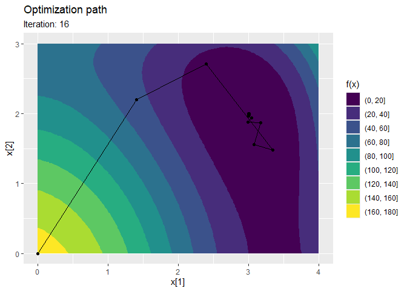
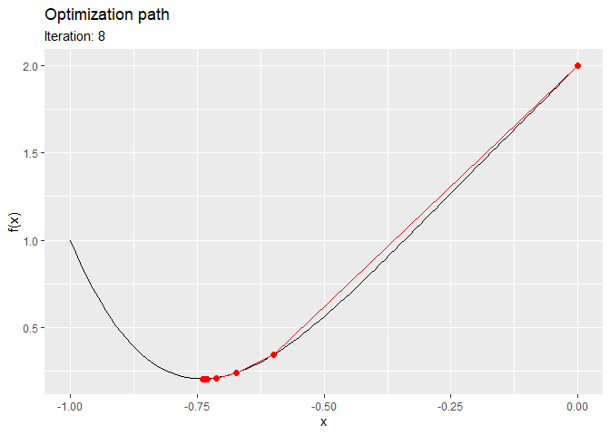

# Track numerical optimization

The [trackopt](https://github.com/loelschlaeger/trackopt) package tracks
parameter values, gradients, and Hessians at each iteration of numerical
optimizers in `R`. This can be useful for analyzing optimization
progress, diagnosing issues, and studying convergence behavior.

## Installation

You can install the released package version from
[CRAN](https://CRAN.R-project.org) with:

``` r

install.packages("trackopt")
```

## Examples

The following example tracks `nlm` while it minimizes [Himmelblau’s
function](https://en.wikipedia.org/wiki/Himmelblau%27s_function):

``` r

library("trackopt")
himmelblau <- function(x) (x[1]^2 + x[2] - 11)^2 + (x[1] + x[2]^2 - 7)^2
track <- nlm_track(f = himmelblau, p = c(0, 0))
summary(track)
#> Iterations: 16
#> Function improvement: 170 -> 1.521e-07
#> Computation time: 0.07373 seconds
#> Initial parameter: 0, 0
#> Final parameter: 3, 2
ggplot2::autoplot(track)
```



The next example tracks `optim` while it minimizes a quartic polynomial:

``` r

polynomial <- function(x) 5 * x^4 + 4 * x^3 + x^2 + 3 * x + 2
gradient <- function(x) 20 * x^3 + 12 * x^2 + 2 * x + 3
track <- optim_track(
  f = polynomial,
  p = 0,
  gradient = gradient,
  method = "BFGS"
)
print(track)
#> # A tibble: 9 × 6
#>   iteration value         step parameter hessian seconds
#> *     <dbl> <dbl>        <dbl>     <dbl>   <dbl>   <dbl>
#> 1         0 2      0               0       NA    0      
#> 2         1 0.344 -1.66           -0.6      9.20 0.00830
#> 3         2 0.241 -0.103          -0.672   13.0  0.00156
#> 4         3 0.212 -0.0293         -0.712   15.3  0.00144
#> 5         4 0.207 -0.00524        -0.730   16.4  0.00144
#> 6         5 0.206 -0.000679       -0.736   16.8  0.00143
#> 7         6 0.206 -0.0000752      -0.738   17.0  0.00271
#> 8         7 0.206 -0.00000784     -0.739   17.0  0.00151
#> 9         8 0.206 -0.000000802    -0.739   17.0  0.00147
ggplot2::autoplot(track)
```



## Contact

If you have questions, find a bug, or need a feature, please [file an
issue on
GitHub](https://github.com/loelschlaeger/trackopt/issues/new/choose).
